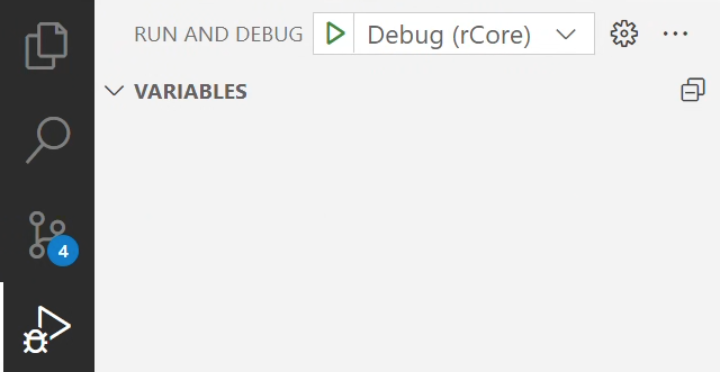

```
OS: Ubuntu 24.04 noble(on the Windows Subsystem for Linux)
```

## 准备工作

### 编译 GDB

安装必要依赖

```bash
sudo apt-get install libncurses5-dev python python-dev texinfo libreadline-dev
```

在[官网](https://sourceware.org/gdb/download/)下载最新版本 GDB 14.2 源码。

```bash
# 解压 GDB 源码
tar xf ./gdb-14.2.tar.gz
# 创建一个专用于构建的目录
mkdir -p build/build-gdb
cd build/build-gdb
# configure
PREFIX="$HOME/opt/cross/"
../../gdb-14.2/configure --prefix=$PREFIX --with-python=python3 --target=riscv64-unknown-elf --enable-tui=yes
# 构建
make -j 20
# 将构建产物安装到 $PREFIX/bin 中
make install
```

安装完成后 `$PREFIX/bin` 目录中应出现 `riscv64-unknown-elf-gdb` 

### 配置 VSCode

创建文件 `.vscode/launch.json`

```json
{
    "version": "0.2.0",
    "configurations": [
        {
            "name": "Debug (rCore)",
            "type": "cppdbg",
            "request": "launch",
            "program": "${workspaceFolder}/os/target/riscv64gc-unknown-none-elf/release/os",
            "miDebuggerServerAddress": "127.0.0.1:1234",
            "miDebuggerPath": "${userHome}/opt/cross/bin/riscv64-unknown-elf-gdb",
            "MIMode": "gdb",
            "cwd": "${workspaceRoot}",
            "setupCommands": [
                {
                    "description": "Enable pretty-printing for gdb",
                    "text": "-enable-pretty-printing",
                    "ignoreFailures": true
                },
                {
                    "description": "Architecture specific setup",
                    "text": "set arch riscv:rv64",
                }
            ]
        }
    ]
}
```

## 启动调试

先进入 rCore 源码目录

```bash
cd os
# 启动 gdb 服务器
make gdbserver
```

点击 ▶️ 就可以启动调试了。



[^1]: 实验环境配置 https://rcore-os.cn/rCore-Tutorial-Book-v3/chapter0/5setup-devel-env.html
[^2]: 使用 GDB 对 rCore 进行 debug* https://rcore-os.cn/rCore-Tutorial-deploy/docs/pre-lab/gdb.html