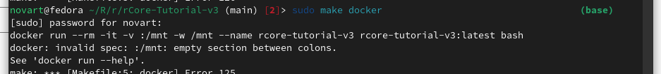
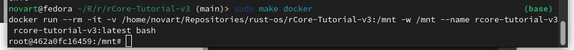
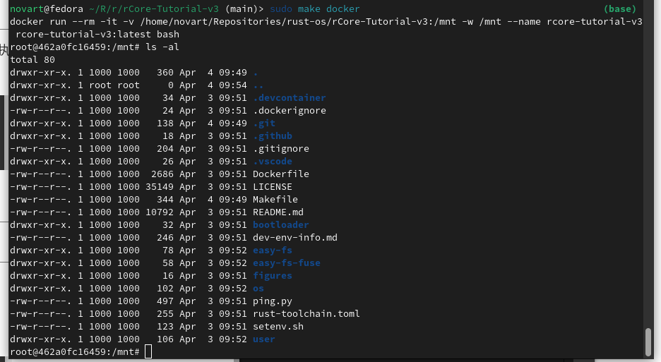
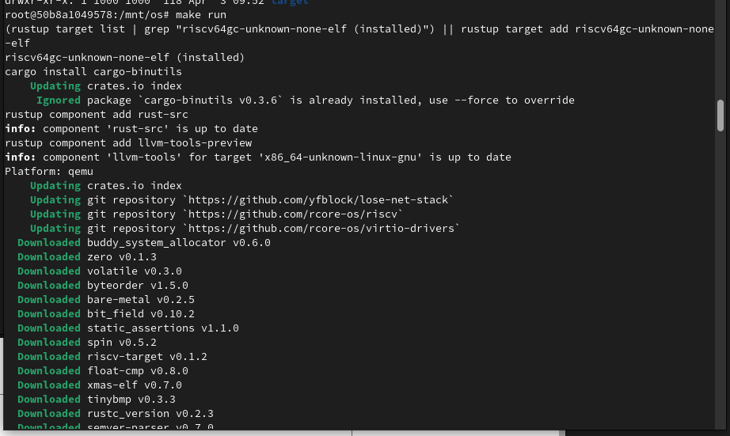
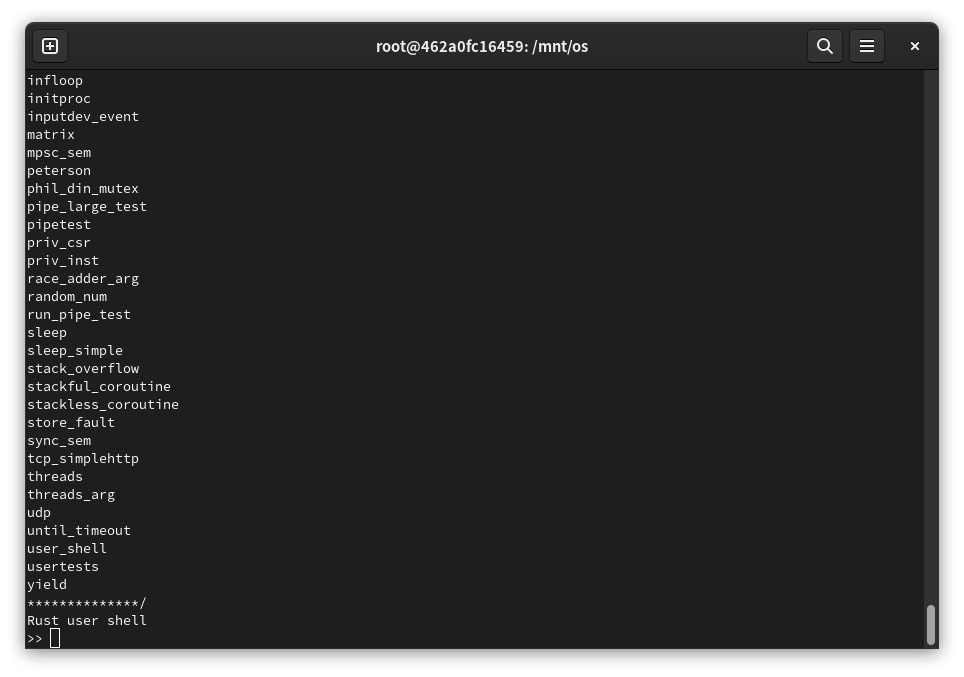
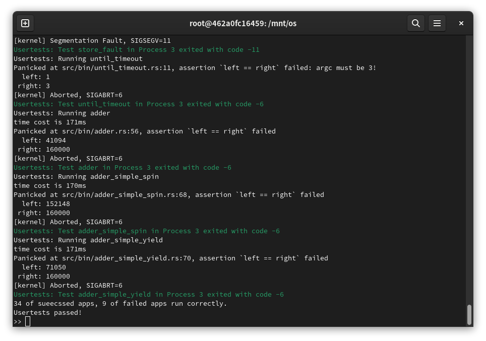
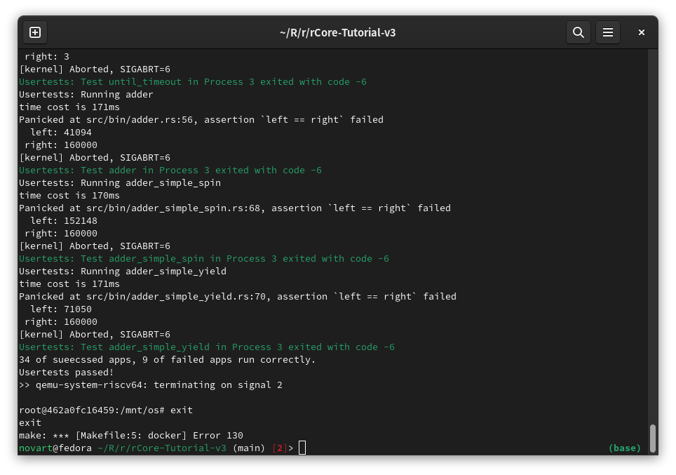

# 实验环境配置（Fedora 38）

## 1. 依赖准备

选择docker方式部署，故需要先安装docker-ce，Fedora 38所用命令如下，其他发行版请参考[Docker官网](https://docs.docker.com/engine/install/fedora/)：

```shell
# a.添加repo
sudo dnf config-manager --add-repo https://download.docker.com/linux/fedora/docker-ce.repo
# b.安装docker-ce
sudo dnf install docker-ce docker-ce-cli containerd.io docker-buildx-plugin docker-compose-plugin
```

安装过程中，命令行会提示确认发行方的GPG公钥指纹为`060A 61C5 1B55 8A7F 742B 77AA C52F EB6B 621E 9F35`。

docker安装完成后，sudo启动服务：

```shell
sudo systemctl start docker
```

## 2. 实验环境部署

使用docker部署环境则较为简单，cd到仓库根目录下执行以下命令即可：

```shell
# a.下载容器镜像
sudo make build_docker
# b.启动容器
sudo make docker
```

**Note**：git上latest版本（`aaab6d3d`）的Makefile写的有点问题，其中用到了`${PWD}`变量。如果用非root用户通过sudo命令执行`make docker`命令，将无法读取正确的路径从而导致以下报错：



可通过修改Makefile解决，运行以下命令后，再次执行`sudo make docker`即可：

```shell
# 替换Makefile中的所有${PWD}为$(CURDIR)
sed -i 's/\${PWD}/$(CURDIR)/g' Makefile
```

## 3. 简单验证

运行`make docker`命令进入容器后表现如下，默认进入`/mnt`目录：



使用ls命令检查目录，与容器外部工作路径下的目录一致：



此时可cd到os目录下将rCore运行起来看一下：

```shell
# a.切到os目录
cd ./os
# b.编译并运行rCore
# （此时docker环境需能访问互联网，并可流畅连接github，cargo会联网下载并更新用到的库）
make run
```



编译成功后，表现如下：



输入`usertests`回车，启动自动化测试，测试时终端会持续打印日志，完成后结果如下：



按<kbd>Ctrl-C</kbd>可退出rCore，再次输入exit可退出容器：



至此实验环境部署基本成功，可以参考课件进行后续实验。